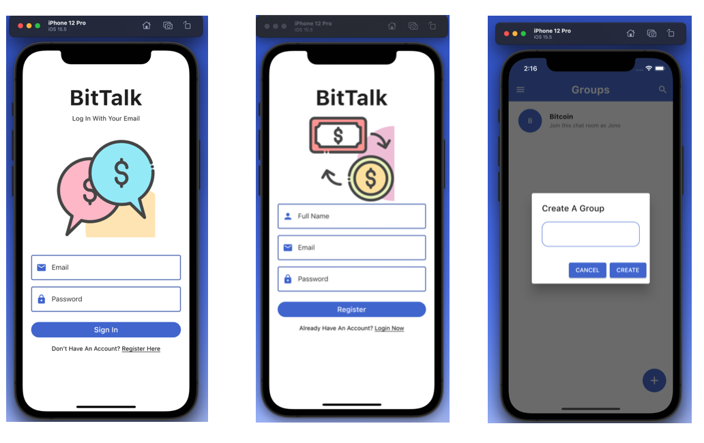
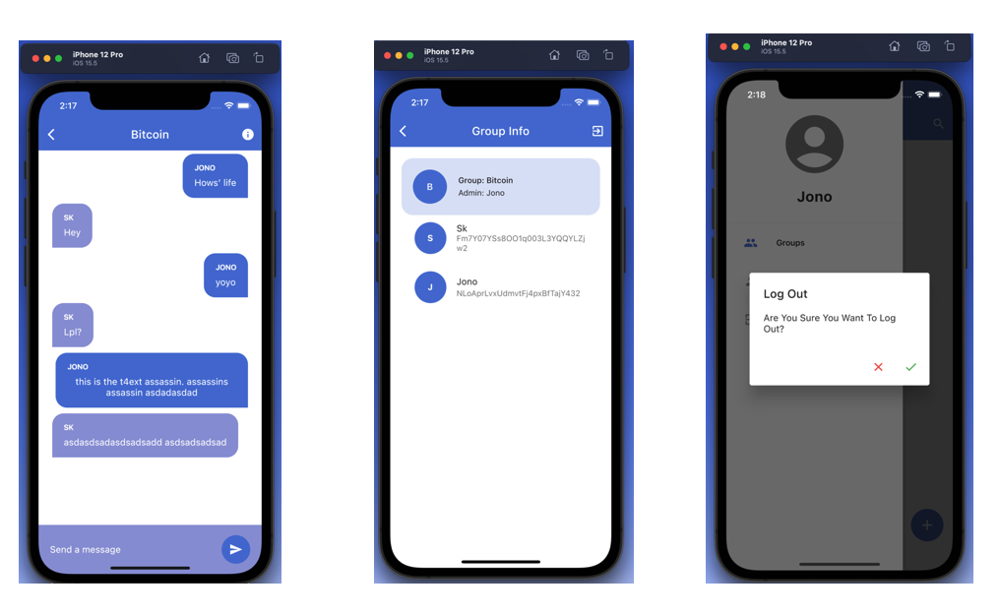

# BitTalk

A simple chat app using Flutter and Firebase.

## Technologies

- Flutter
- Dart
- Firebase

## Features

- Login and Register
- Email & Password Authentication
- Check user profile
- Create a new group chat
- Join or leave a group chat
- Search for existing group chat/s
- Realtime chat in group chat
- Check existing members of the group
- Log out
- Error handling

## How To Set Up

1. Add this project to your own Firebase account.
1. For Android: Add your own google-services.json to android -> app folder, and update build.gradle in both android and app.
1. For iOS: Add your own GoogleServices-info.plist to ios -> Runner folder.
1. In lib -> shared -> constants, put your own apiKey, appID, messagingSenderId, and projectId.
1. Run the app using either iOS simulator or Android emulator.
1. If you do not have iOS simulator or Android emulator on your computer, go to your terminal and run `flutter run -d chrome` to see it on Chrome or any other browser you want.

## Future plans

- Timestamp for the chat could be added.
- Adding/deleting profile picture could be added.
